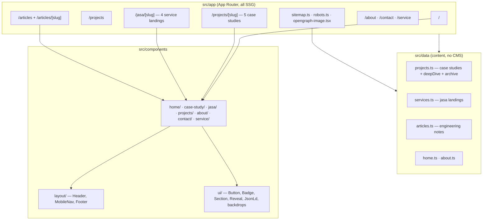

# oksasatya.dev — Personal Portfolio

Portfolio of **Oksa Satya**, full-stack developer (backend-focused) who builds business
operations systems: HRIS & payroll, POS, inventory, and multi-tenant SaaS. The site
converts two audiences — Indonesian freelance clients and remote employers — with
**Dexova** (his ERP SaaS) as the flagship case study.

Fully redesigned July 2026: custom Tailwind v4 design system replacing the previous
Bootstrap template (audit + decisions in `docs/redesign-plan.md`).

## Stack

- **Next.js 14** (App Router, SSG for every route) + TypeScript strict
- **Tailwind CSS v4** — CSS-first `@theme` tokens in `src/styles/globals.css`; tokens
  documented in `DESIGN.md`
- **Fonts:** Bricolage Grotesque (display) · Figtree (body) · JetBrains Mono (labels)
  via `next/font`
- **Icons:** lucide-react (+ inline brand SVGs)
- **Motion & 3D:** CSS transitions + one IntersectionObserver reveal hook, plus a lazy
  three.js "system blueprint" scene (@react-three/fiber, idle-deferred, static SVG
  fallback, `prefers-reduced-motion` respected)
- **i18n:** next-intl v4 — Indonesian unprefixed, English under `/en/*`
  (`messages/{id,en}.json` + per-locale data files)
- **Contact:** WhatsApp deep links (no backend, no stored data) — single source in
  `src/lib/contact.ts`

## Architecture



Content lives in typed data files (`src/data/*`), presentation in components. Flagship
case studies use the `deepDive` structure (sections + screenshots + labeled diagrams);
smaller projects use the compact template automatically.

## Development

```bash
npm run dev     # dev server
npm run build   # production build (all routes prerendered)
npm run lint    # eslint (next/core-web-vitals)
npx tsc --noEmit
```

## Quality gates

- Lighthouse (production build, dark theme + 3D active): desktop 100/100/100 ·
  mobile 95/100/100 (SEO shows 92 on localhost only — canonical points at the
  production domain; on oksasatya.dev it resolves to self and passes)
- WCAG AA contrast verified per token pair (`DESIGN.md`)
- Responsive from 320px, no horizontal overflow
- JSON-LD: Person, WebSite, ProfilePage, ProfessionalService, Service, FAQPage,
  CreativeWork, Article, BreadcrumbList

## SEO

Unique metadata + canonical per route, `sitemap.ts` with real lastmod, `robots.ts`,
generated OG image. URL structure is preserved from the previous site (no equity loss);
new routes: `/articles/*`, `/projects/dexova-hris`, `/projects/dexova-pos`.

## Content rules

- No fabricated metrics or testimonials — verifiable proof only.
- Product screenshots use demo data and pass a redaction check before publishing.
- Compliance topics (PPh 21, BPJS, PP 35/2021) are described as implemented business
  rules, never as tax/legal advice.
